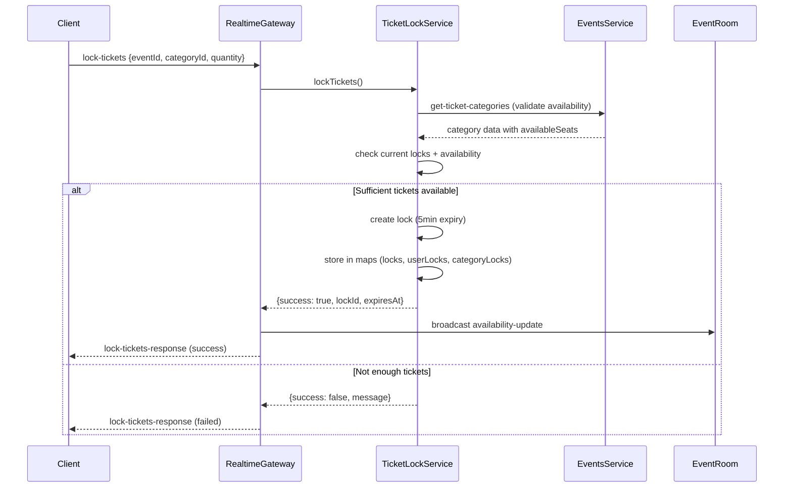

# WebSocket Integration Guide for NextJS 15

## Overview

This guide explains how to properly consume the WebSocket from your `realtime-service` microservice in a NextJS 15 application. The realtime service provides real-time ticket availability updates, ticket locking mechanisms, and order notifications.

## Architecture Overview

- **WebSocket Server**: `ws://localhost:8880/realtime`
- **Protocol**: Socket.IO v4+
- **Authentication**: JWT token (query param or auth object)
- **Namespace**: `/realtime`

## How the Realtime Service Works

### Microservice Architecture

The `realtime-service` is a NestJS microservice that serves dual purposes:
1. **WebSocket Gateway**: Handles real-time client connections via Socket.IO
2. **RabbitMQ Consumer**: Receives messages from other microservices (orders, events)

### Core Components

#### 1. **RealtimeGateway** (`realtime.gateway.ts`)
The main WebSocket handler that manages client connections and real-time events.

**Key Responsibilities:**
- Handle client connections/disconnections
- Manage event room subscriptions
- Process ticket lock/unlock requests
- Broadcast availability updates
- Handle external service notifications

**Connection Flow:**
```typescript
// Client connects
handleConnection() → validates userId → stores session info → emits 'connected'

// Client joins event room
join-event-room → validates user → joins Socket.IO room → sends availability

// Client locks tickets
lock-tickets → validates → calls TicketLockService → broadcasts update

// Client disconnects
handleDisconnect() → releases all user locks → broadcasts availability
```

#### 2. **TicketLockService** (`ticket-lock.service.ts`)
Manages the in-memory ticket locking mechanism with automatic expiration.

**Key Features:**
- **Lock Duration**: 5 minutes per lock
- **Collision Prevention**: One lock per user per category
- **Auto-cleanup**: Expired locks removed every minute
- **Real-time Validation**: Checks against events-service for availability

**Data Structures:**
```typescript
// Primary lock storage
locks: Map<string, TicketLock>

// User-to-locks mapping
userLocks: Map<number, Set<string>>

// Category-to-locks mapping (eventId_categoryId)
categoryLocks: Map<string, Set<string>>
```

**Lock Lifecycle:**
```
CREATE → ACTIVE → (EXPIRED/CONFIRMED/RELEASED) → CLEANUP
   ↓        ↓              ↓
5 min   Auto-expire    External action
timer   (background)   (order/cancel)
```

#### 3. **Message Patterns** (RabbitMQ Integration)
The service listens for messages from other microservices:

```typescript
// From orders-service
'confirm-ticket-lock' → confirms a lock when order is created
'order-completed' → broadcasts availability update + notifies user
'order-cancelled' → releases locks + broadcasts availability

// From events-service (planned)
'event-capacity-changed' → triggers availability updates
'event-cancelled' → releases all event locks
```

### WebSocket Events Reference

#### **Client → Server Events**

| Event | Payload | Description |
|-------|---------|-------------|
| `join-event-room` | `{eventId, userId}` | Subscribe to event availability updates |
| `leave-event-room` | `{eventId}` | Unsubscribe from event updates |
| `lock-tickets` | `{eventId, categoryId, quantity, userId}` | Request ticket lock (5min reservation) |
| `unlock-tickets` | `{eventId, categoryId, quantity, userId}` | Release ticket lock manually |
| `get-my-locks` | `{}` | Get all active locks for current user |
| `heartbeat` | `{}` | Keep connection alive |

#### **Server → Client Events**

| Event | Payload | Description |
|-------|---------|-------------|
| `connected` | `{success, sessionId, message}` | Connection confirmation |
| `joined-event-room` | `{success, eventId, message}` | Room join confirmation |
| `lock-tickets-response` | `{success, lockId?, expiresAt?, message?, availableTickets?}` | Lock request result |
| `unlock-tickets-response` | `{success, message}` | Unlock request result |
| `availability-update` | `{eventId, categoryId, availableTickets, lockedTickets, totalTickets, timestamp}` | Real-time availability change |
| `my-locks-response` | `{locks: TicketLock[]}` | User's current locks |
| `order-completed` | `{orderId, eventId, categoryId, quantity, message}` | Order success notification |
| `order-cancelled` | `{orderId, eventId, categoryId, quantity, message}` | Order cancellation notification |
| `error` | `{message}` | Error notification |

### Ticket Locking Flow



### Integration with Other Services

#### **Events Service Communication**
```typescript
// TCP Client connection to events-service (port 8879)
this.eventsClient.send('get-ticket-categories', eventId)
// Returns: [{id, name, price, totalSeats, availableSeats}]
```

#### **Orders Service Communication**
```typescript
// RabbitMQ patterns the service handles:

// When order is created with lock
@MessagePattern('confirm-ticket-lock')
async confirmTicketLock(data: {lockId: string})

// When order payment succeeds
@MessagePattern('order-completed') 
async handleOrderCompleted(data: {orderId, eventId, categoryId, quantity, userId})

// When order is cancelled/fails
@MessagePattern('order-cancelled')
async handleOrderCancelled(data: {orderId, eventId, categoryId, quantity, userId})
```

### Room-Based Broadcasting

The service uses Socket.IO rooms for efficient message broadcasting:

```typescript
// Room naming convention
const roomName = `event_${eventId}`;

// When availability changes
this.server.to(roomName).emit('availability-update', {
  eventId,
  categoryId,
  availableTickets,
  lockedTickets,
  totalTickets,
  timestamp: new Date()
});
```

### Session Management

Each connected client has session information stored in memory:

```typescript
interface UserSessionInfo {
  userId: number;
  sessionId: string;     // Socket ID
  eventId: number;       // Currently subscribed event
  locks: TicketLock[];   // Active locks for this session
  connectedAt: Date;
  lastActivity: Date;
}

// Stored in: Map<string, UserSessionInfo>
private connectedUsers: Map<string, UserSessionInfo>
```

### Auto-Cleanup Mechanisms

#### **1. Lock Expiration (Every 60 seconds)**
```typescript
setInterval(() => {
  this.cleanupExpiredLocks();
}, 60 * 1000);

private cleanupExpiredLocks(): void {
  const now = new Date();
  for (const [lockId, lock] of this.locks) {
    if (lock.status === 'active' && lock.expiresAt <= now) {
      lock.status = 'expired';
      this.releaseLock(lockId);
    }
  }
}
```

#### **2. Disconnection Cleanup**
```typescript
async handleDisconnect(client: AuthenticatedSocket) {
  // Release all locks for this user session
  const releasedLocks = this.ticketLockService.releaseUserLocks(
    client.userId, 
    client.sessionId
  );
  
  // Broadcast availability updates if locks were released
  if (releasedLocks > 0) {
    await this.broadcastAvailabilityUpdates(client.userId);
  }
}
```

### Error Handling & Resilience

#### **1. Connection Resilience**
- Automatic reconnection with exponential backoff
- Heartbeat mechanism for connection monitoring
- Graceful degradation when external services are unavailable

#### **2. Data Consistency**
- Validates ticket availability with events-service before locking
- Handles race conditions with in-memory locks
- Automatic cleanup prevents orphaned locks

#### **3. External Service Failures**
```typescript
try {
  const ticketCategories = await firstValueFrom(
    this.eventsClient.send('get-ticket-categories', lockDto.eventId)
  );
} catch (error) {
  console.error('Failed to fetch ticket availability:', error);
  return {
    success: false,
    message: 'Failed to verify ticket availability'
  };
}
```

### Monitoring & Statistics

The service provides real-time statistics via HTTP endpoint `/stats`:

```typescript
GET http://localhost:8880/stats

// Returns:
{
  "service": "realtime-service",
  "status": "active",
  "connectedUsers": 5,
  "ticketLocks": {
    "totalLocks": 12,
    "activeLocks": 8,
    "usersWithLocks": 3,
    "categoriesWithLocks": 2,
    "locksByStatus": {
      "active": 8,
      "expired": 2,
      "confirmed": 1,
      "released": 1
    }
  }
}
```

### Performance Considerations

#### **1. Memory Management**
- Locks automatically cleaned up after 30 seconds of being released
- User sessions removed on disconnect
- Periodic cleanup prevents memory leaks

#### **2. Broadcasting Efficiency**
- Room-based broadcasting (only users in specific event rooms receive updates)
- Throttled availability updates to prevent spam
- Minimal payload sizes for real-time events

#### **3. Scaling Considerations**
- In-memory storage limits horizontal scaling
- For production: consider Redis for shared lock state
- Sticky sessions required for WebSocket connections

## Key Considerations for NextJS 15

### 1. Client-Side Only Implementation

WebSocket connections must be established on the client side only. NextJS 15 with App Router requires careful handling of client components.

```typescript
'use client'; // Essential for WebSocket usage

import { useEffect, useState } from 'react';
import { io, Socket } from 'socket.io-client';
```

### 2. Installation

```bash
npm install socket.io-client
npm install --save-dev @types/socket.io-client
```

## Complete Implementation

### 1. Create WebSocket Hook

Create `hooks/useRealtimeSocket.ts`:

```typescript
'use client';

import { useEffect, useState, useCallback, useRef } from 'react';
import { io, Socket } from 'socket.io-client';

interface SocketConfig {
  userId: number;
  token?: string;
  autoConnect?: boolean;
}

interface TicketLockResponse {
  success: boolean;
  lockId?: string;
  expiresAt?: string;
  message?: string;
  availableTickets?: number;
}

interface AvailabilityUpdate {
  eventId: number;
  categoryId: number;
  availableTickets: number;
  lockedTickets: number;
  totalTickets: number;
  timestamp: string;
}

interface ConnectionStatus {
  connected: boolean;
  sessionId?: string;
  error?: string;
}

export const useRealtimeSocket = (config: SocketConfig) => {
  const [socket, setSocket] = useState<Socket | null>(null);
  const [connectionStatus, setConnectionStatus] = useState<ConnectionStatus>({
    connected: false
  });
  const [availabilityUpdates, setAvailabilityUpdates] = useState<AvailabilityUpdate[]>([]);
  const reconnectTimeoutRef = useRef<NodeJS.Timeout>();
  const lockResponseRef = useRef<TicketLockResponse | null>(null);

  // Connection function
  const connect = useCallback(() => {
    if (socket?.connected) {
      console.warn('Socket already connected');
      return;
    }

    console.log('🔌 Connecting to realtime service...');

    const newSocket = io('ws://localhost:8880/realtime', {
      auth: {
        token: config.token || 'fake_jwt_token_for_testing'
      },
      query: {
        userId: config.userId.toString()
      },
      transports: ['websocket', 'polling'],
      timeout: 10000,
      forceNew: true
    });

    // Connection events
    newSocket.on('connect', () => {
      console.log('✅ Connected to realtime service');
      setConnectionStatus({ connected: true });
      
      // Clear any existing reconnect timeouts
      if (reconnectTimeoutRef.current) {
        clearTimeout(reconnectTimeoutRef.current);
      }
    });

    newSocket.on('connected', (data) => {
      console.log('🎯 Server confirmed connection:', data);
      setConnectionStatus(prev => ({
        ...prev,
        sessionId: data.sessionId
      }));
    });

    newSocket.on('disconnect', (reason) => {
      console.log('❌ Disconnected from realtime service:', reason);
      setConnectionStatus({ connected: false, error: reason });
      
      // Auto-reconnect logic (except for manual disconnections)
      if (reason !== 'io client disconnect') {
        reconnectTimeoutRef.current = setTimeout(() => {
          console.log('🔄 Attempting to reconnect...');
          connect();
        }, 3000);
      }
    });

    newSocket.on('connect_error', (error) => {
      console.error('❌ Connection error:', error);
      setConnectionStatus({ 
        connected: false, 
        error: error.message 
      });
    });

    // Event handlers
    newSocket.on('joined-event-room', (data) => {
      console.log('🏠 Joined event room:', data);
    });

    newSocket.on('lock-tickets-response', (response: TicketLockResponse) => {
      console.log('🔒 Lock tickets response:', response);
      lockResponseRef.current = response;
    });

    newSocket.on('unlock-tickets-response', (response) => {
      console.log('🔓 Unlock tickets response:', response);
    });

    newSocket.on('availability-update', (update: AvailabilityUpdate) => {
      console.log('📊 Availability update:', update);
      setAvailabilityUpdates(prev => [...prev.slice(-9), update]); // Keep last 10 updates
    });

    newSocket.on('my-locks-response', (data) => {
      console.log('📋 My locks:', data);
    });

    newSocket.on('order-completed', (data) => {
      console.log('✅ Order completed:', data);
    });

    newSocket.on('error', (error) => {
      console.error('❌ Socket error:', error);
      setConnectionStatus(prev => ({
        ...prev,
        error: error.message
      }));
    });

    setSocket(newSocket);
  }, [config.userId, config.token, socket]);

  // Disconnect function
  const disconnect = useCallback(() => {
    if (reconnectTimeoutRef.current) {
      clearTimeout(reconnectTimeoutRef.current);
    }
    
    if (socket) {
      socket.disconnect();
      setSocket(null);
      setConnectionStatus({ connected: false });
    }
  }, [socket]);

  // Join event room
  const joinEventRoom = useCallback((eventId: number) => {
    if (!socket?.connected) {
      console.warn('Socket not connected');
      return;
    }

    socket.emit('join-event-room', {
      eventId,
      userId: config.userId
    });
  }, [socket, config.userId]);

  // Leave event room
  const leaveEventRoom = useCallback((eventId: number) => {
    if (!socket?.connected) {
      console.warn('Socket not connected');
      return;
    }

    socket.emit('leave-event-room', {
      eventId
    });
  }, [socket]);

  // Lock tickets
  const lockTickets = useCallback(async (
    eventId: number,
    categoryId: number,
    quantity: number
  ): Promise<TicketLockResponse> => {
    return new Promise((resolve, reject) => {
      if (!socket?.connected) {
        reject(new Error('Socket not connected'));
        return;
      }

      // Set up one-time listener for response
      const timeout = setTimeout(() => {
        reject(new Error('Lock tickets timeout'));
      }, 10000);

      const handleResponse = (response: TicketLockResponse) => {
        clearTimeout(timeout);
        socket.off('lock-tickets-response', handleResponse);
        resolve(response);
      };

      socket.on('lock-tickets-response', handleResponse);

      socket.emit('lock-tickets', {
        eventId,
        categoryId,
        quantity,
        userId: config.userId
      });
    });
  }, [socket, config.userId]);

  // Unlock tickets
  const unlockTickets = useCallback((
    eventId: number,
    categoryId: number,
    quantity: number
  ) => {
    if (!socket?.connected) {
      console.warn('Socket not connected');
      return;
    }

    socket.emit('unlock-tickets', {
      eventId,
      categoryId,
      quantity,
      userId: config.userId
    });
  }, [socket, config.userId]);

  // Get my locks
  const getMyLocks = useCallback(() => {
    if (!socket?.connected) {
      console.warn('Socket not connected');
      return;
    }

    socket.emit('get-my-locks');
  }, [socket]);

  // Auto-connect on mount if enabled
  useEffect(() => {
    if (config.autoConnect !== false) {
      connect();
    }

    return () => {
      if (reconnectTimeoutRef.current) {
        clearTimeout(reconnectTimeoutRef.current);
      }
      disconnect();
    };
  }, [config.autoConnect, connect, disconnect]);

  return {
    socket,
    connectionStatus,
    availabilityUpdates,
    connect,
    disconnect,
    joinEventRoom,
    leaveEventRoom,
    lockTickets,
    unlockTickets,
    getMyLocks
  };
};
```

### 2. Create Ticket Management Component

Create `components/TicketManager.tsx`:

```typescript
'use client';

import React, { useState, useEffect } from 'react';
import { useRealtimeSocket } from '@/hooks/useRealtimeSocket';

interface TicketManagerProps {
  userId: number;
  eventId: number;
  token?: string;
}

export const TicketManager: React.FC<TicketManagerProps> = ({
  userId,
  eventId,
  token
}) => {
  const [categoryId, setCategoryId] = useState(1);
  const [quantity, setQuantity] = useState(1);
  const [currentLock, setCurrentLock] = useState<any>(null);
  const [loading, setLoading] = useState(false);

  const {
    connectionStatus,
    availabilityUpdates,
    connect,
    disconnect,
    joinEventRoom,
    lockTickets,
    unlockTickets,
    getMyLocks
  } = useRealtimeSocket({
    userId,
    token,
    autoConnect: true
  });

  // Auto-join event room when connected
  useEffect(() => {
    if (connectionStatus.connected) {
      joinEventRoom(eventId);
    }
  }, [connectionStatus.connected, eventId, joinEventRoom]);

  const handleLockTickets = async () => {
    try {
      setLoading(true);
      const response = await lockTickets(eventId, categoryId, quantity);
      
      if (response.success) {
        setCurrentLock(response);
        console.log('✅ Tickets locked successfully:', response);
      } else {
        console.error('❌ Failed to lock tickets:', response.message);
        alert(`Failed to lock tickets: ${response.message}`);
      }
    } catch (error) {
      console.error('❌ Error locking tickets:', error);
      alert(`Error locking tickets: ${error}`);
    } finally {
      setLoading(false);
    }
  };

  const handleUnlockTickets = () => {
    unlockTickets(eventId, categoryId, quantity);
    setCurrentLock(null);
  };

  return (
    <div className="p-6 max-w-2xl mx-auto bg-white rounded-lg shadow-lg">
      <h2 className="text-2xl font-bold mb-6">🎫 Ticket Manager</h2>
      
      {/* Connection Status */}
      <div className={`p-4 rounded-lg mb-6 ${
        connectionStatus.connected 
          ? 'bg-green-100 text-green-800' 
          : 'bg-red-100 text-red-800'
      }`}>
        <h3 className="font-semibold">
          {connectionStatus.connected ? '🟢 Connected' : '🔴 Disconnected'}
        </h3>
        {connectionStatus.sessionId && (
          <p className="text-sm">Session: {connectionStatus.sessionId}</p>
        )}
        {connectionStatus.error && (
          <p className="text-sm">Error: {connectionStatus.error}</p>
        )}
      </div>

      {/* Connection Controls */}
      <div className="flex gap-4 mb-6">
        <button
          onClick={connect}
          disabled={connectionStatus.connected}
          className="px-4 py-2 bg-blue-500 text-white rounded disabled:bg-gray-300"
        >
          Connect
        </button>
        <button
          onClick={disconnect}
          disabled={!connectionStatus.connected}
          className="px-4 py-2 bg-red-500 text-white rounded disabled:bg-gray-300"
        >
          Disconnect
        </button>
      </div>

      {/* Ticket Controls */}
      <div className="bg-gray-50 p-4 rounded-lg mb-6">
        <h3 className="font-semibold mb-4">Ticket Controls</h3>
        
        <div className="grid grid-cols-2 gap-4 mb-4">
          <div>
            <label className="block text-sm font-medium mb-1">Category ID</label>
            <input
              type="number"
              value={categoryId}
              onChange={(e) => setCategoryId(parseInt(e.target.value))}
              className="w-full p-2 border rounded"
              min="1"
            />
          </div>
          <div>
            <label className="block text-sm font-medium mb-1">Quantity</label>
            <input
              type="number"
              value={quantity}
              onChange={(e) => setQuantity(parseInt(e.target.value))}
              className="w-full p-2 border rounded"
              min="1"
              max="10"
            />
          </div>
        </div>

        <div className="flex gap-2">
          <button
            onClick={handleLockTickets}
            disabled={!connectionStatus.connected || loading}
            className="px-4 py-2 bg-orange-500 text-white rounded disabled:bg-gray-300"
          >
            {loading ? '🔄 Locking...' : '🔒 Lock Tickets'}
          </button>
          <button
            onClick={handleUnlockTickets}
            disabled={!connectionStatus.connected || !currentLock}
            className="px-4 py-2 bg-green-500 text-white rounded disabled:bg-gray-300"
          >
            🔓 Unlock Tickets
          </button>
          <button
            onClick={getMyLocks}
            disabled={!connectionStatus.connected}
            className="px-4 py-2 bg-blue-500 text-white rounded disabled:bg-gray-300"
          >
            📋 My Locks
          </button>
        </div>
      </div>

      {/* Current Lock Info */}
      {currentLock && (
        <div className="bg-yellow-50 p-4 rounded-lg mb-6">
          <h3 className="font-semibold text-yellow-800 mb-2">Current Lock</h3>
          <p><strong>Lock ID:</strong> {currentLock.lockId}</p>
          <p><strong>Expires:</strong> {new Date(currentLock.expiresAt).toLocaleString()}</p>
          <p><strong>Available:</strong> {currentLock.availableTickets}</p>
        </div>
      )}

      {/* Availability Updates */}
      <div className="bg-blue-50 p-4 rounded-lg">
        <h3 className="font-semibold text-blue-800 mb-4">
          📊 Real-time Availability Updates
        </h3>
        {availabilityUpdates.length === 0 ? (
          <p className="text-gray-600">No updates yet...</p>
        ) : (
          <div className="space-y-2 max-h-40 overflow-y-auto">
            {availabilityUpdates.slice(-5).map((update, index) => (
              <div key={index} className="text-sm bg-white p-2 rounded">
                <strong>Event {update.eventId} - Category {update.categoryId}</strong>
                <br />
                Available: {update.availableTickets} | 
                Locked: {update.lockedTickets} | 
                Total: {update.totalTickets}
                <br />
                <span className="text-gray-500">
                  {new Date(update.timestamp).toLocaleTimeString()}
                </span>
              </div>
            ))}
          </div>
        )}
      </div>
    </div>
  );
};
```

### 3. Usage in NextJS 15 Page/Component

Create `app/tickets/page.tsx`:

```typescript
'use client';

import { TicketManager } from '@/components/TicketManager';
import { useState } from 'react';

export default function TicketsPage() {
  const [userId] = useState(123); // Get from auth context
  const [eventId] = useState(1);   // Get from props/params

  return (
    <main className="min-h-screen bg-gray-100 py-8">
      <div className="container mx-auto">
        <h1 className="text-3xl font-bold text-center mb-8">
          Real-time Ticket System
        </h1>
        
        <TicketManager
          userId={userId}
          eventId={eventId}
          token="your_jwt_token_here"
        />
      </div>
    </main>
  );
}
```

### 4. Environment Configuration

Create or update `.env.local`:

```env
# WebSocket Configuration
NEXT_PUBLIC_REALTIME_WS_URL=ws://localhost:8880/realtime
NEXT_PUBLIC_API_URL=http://localhost:3000/api

# Development settings
NODE_ENV=development
```

## Common Issues and Solutions

### 1. Hydration Errors

**Problem**: NextJS 15 hydration errors with WebSocket connections.

**Solution**: Always use `'use client'` directive and ensure WebSocket logic only runs on client:

```typescript
'use client';

import { useEffect, useState } from 'react';

export function MyComponent() {
  const [mounted, setMounted] = useState(false);
  
  useEffect(() => {
    setMounted(true);
  }, []);

  if (!mounted) {
    return <div>Loading...</div>;
  }

  // WebSocket logic here
}
```

### 2. Connection Management

**Problem**: Multiple connections or reconnection issues.

**Solution**: Use proper cleanup and connection state management:

```typescript
useEffect(() => {
  // Connection logic
  return () => {
    // Cleanup
    socket?.disconnect();
  };
}, []);
```

### 3. TypeScript Issues

**Problem**: Socket.IO types not working properly.

**Solution**: Install proper types and use interfaces:

```bash
npm install --save-dev @types/socket.io-client
```

### 4. CORS Issues

**Problem**: CORS errors in development.

**Solution**: Ensure proper CORS configuration in your realtime service:

```typescript
// In realtime service
app.enableCors({
  origin: ['http://localhost:3000', 'http://localhost:3001'], // Add your NextJS URLs
  methods: ['GET', 'POST'],
  credentials: true,
});
```

## Best Practices

### 1. Error Handling
- Always implement proper error handling for connection failures
- Use timeouts for WebSocket operations
- Implement retry logic with exponential backoff

### 2. State Management
- Consider using Zustand or Redux for complex real-time state
- Keep WebSocket state separate from UI state
- Implement proper loading states

### 3. Performance
- Throttle frequent updates to prevent UI lag
- Implement virtual scrolling for large lists of updates
- Use React.memo for components that receive frequent updates

### 4. Security
- Always validate data received from WebSocket
- Implement proper authentication with JWT tokens
- Use HTTPS/WSS in production

### 5. Testing
- Mock WebSocket connections in tests
- Test connection failure scenarios
- Implement integration tests with real WebSocket server

## Production Considerations

1. **Environment Variables**: Use different URLs for development/production
2. **SSL/TLS**: Use WSS protocol in production
3. **Load Balancing**: Configure sticky sessions for WebSocket connections
4. **Monitoring**: Implement proper logging and monitoring for WebSocket connections
5. **Rate Limiting**: Implement rate limiting on the server side

## Example Integration with Authentication

```typescript
// hooks/useAuth.ts
export const useAuth = () => {
  // Your auth logic
  return {
    user: { id: 123, token: 'jwt_token' },
    isAuthenticated: true
  };
};

// In your component
const { user, isAuthenticated } = useAuth();

return isAuthenticated ? (
  <TicketManager
    userId={user.id}
    eventId={eventId}
    token={user.token}
  />
) : (
  <LoginForm />
);
```

This guide should help you properly integrate the WebSocket functionality from your realtime-service into a NextJS 15 application with proper error handling, type safety, and best practices.
